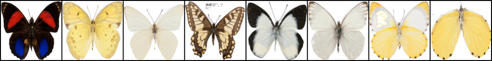
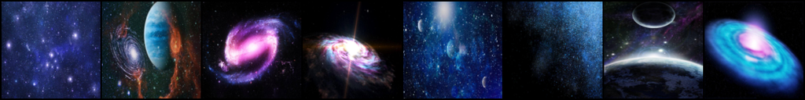

# Unet-model-generate-picture
This is link https://github.com/wwwwnn/Unet-model-generate-picture/tree/main
This is our final project for INDENG 223 at UC Berkeley. Our team members are Shuimei Sun, Edward Zeng, Yelin Bao, Chunhao Wang, Weinan Weng, Mingduo Zhao, and Chenlong Li.

We modified the hyperparameters of the traditional unet network so that it can generate higher quality images

